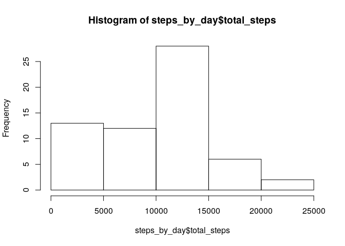
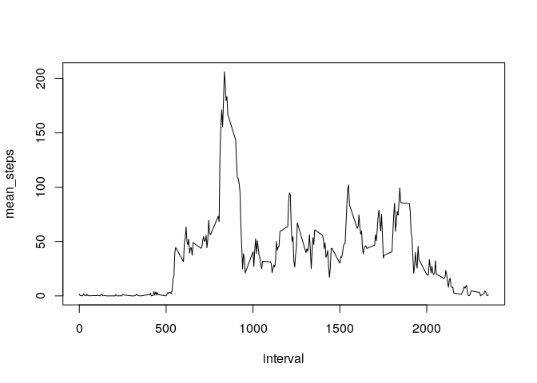
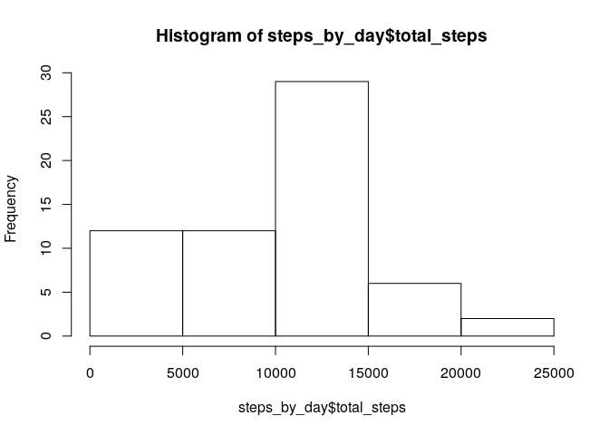
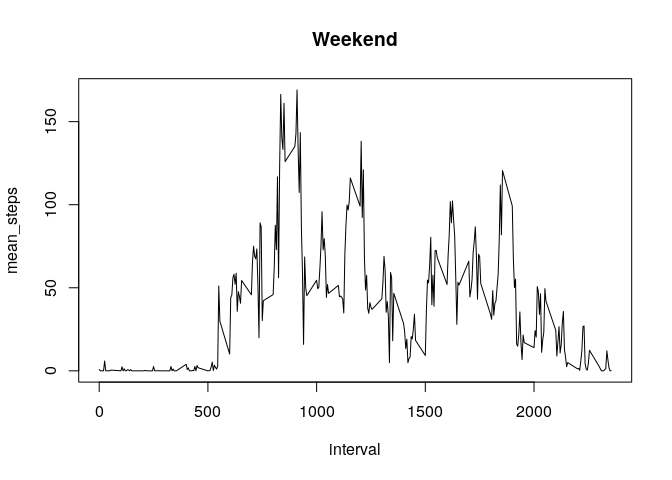
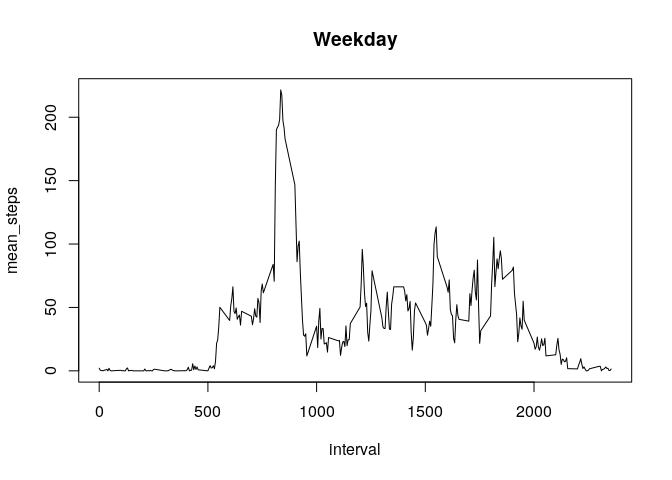

## Loading and preprocessing the data


```r
data <- read.csv("activity.csv");
head(data)
```

```
##   steps       date interval
## 1    NA 2012-10-01        0
## 2    NA 2012-10-01        5
## 3    NA 2012-10-01       10
## 4    NA 2012-10-01       15
## 5    NA 2012-10-01       20
## 6    NA 2012-10-01       25
```

## What is mean total number of steps taken per day?

```r
steps_by_day <- data %>% group_by(date) %>% 
        summarise(date = unique(date),total_steps = sum(steps,na.rm = T))
hist(steps_by_day$total_steps)
```

<!-- -->

Mean of the steps by day

```r
mean(steps_by_day$total_steps)
```

```
## [1] 9354.23
```

Median

```r
median(steps_by_day$total_steps)
```

```
## [1] 10395
```

## What is the average daily activity pattern?

```r
avg_interval <- data %>% group_by(interval) %>% 
        summarise(interval = unique(interval),mean_steps = mean(steps,na.rm = T))
plot(avg_interval, type = 'l')
```

<!-- -->

Which 5-minute interval, on average across all the days in the dataset, contains the maximum number of steps?


```r
avg_interval[which.max(avg_interval$mean_steps),]$interval
```

```
## [1] 835
```
is the interval number **835**

## Imputing missing values

```r
table(is.na(data$steps))[[2]]
```

```
## [1] 2304
```
There are **2304** missing values


The strategy is input the mean for that 5-minute interval


```r
datafull <- data
for(i in 1:nrow(data)){
        if (is.na(datafull[i,]$steps)){
                datafull[i,]$steps <- avg_interval[i,]$mean_steps
        }
}
```

```
## Warning: The `i` argument of ``[.tbl_df`()` must lie in [0, rows] if positive, as of tibble 3.0.0.
## Use `NA_integer_` as row index to obtain a row full of `NA` values.
## This warning is displayed once every 8 hours.
## Call `lifecycle::last_warnings()` to see where this warning was generated.
```

```r
head(datafull)
```

```
##       steps       date interval
## 1 1.7169811 2012-10-01        0
## 2 0.3396226 2012-10-01        5
## 3 0.1320755 2012-10-01       10
## 4 0.1509434 2012-10-01       15
## 5 0.0754717 2012-10-01       20
## 6 2.0943396 2012-10-01       25
```

```r
steps_by_day <- datafull %>% group_by(date) %>% 
        summarise(date = unique(date),total_steps = sum(steps,na.rm = T))
hist(steps_by_day$total_steps)
```

<!-- -->

Mean of the steps by day

```r
mean(steps_by_day$total_steps)
```

```
## [1] 9530.724
```

Median

```r
median(steps_by_day$total_steps)
```

```
## [1] 10439
```

*Do these values differ from the estimates from the first part of the assignment? 

Yes, there is an increase in the mean and median, in addition to some intervals of the histogram

## Are there differences in activity patterns between weekdays and weekends?

```r
datafull$date <- as.Date(datafull$date)
datafull <- mutate(datafull,week_time = ifelse(wday(date) %in% c(1,2),"weekend","weekday"))
week <- split(datafull, datafull$week_time)
weekend <- week[[2]]
weekday <- week[[1]]
```

Weekend: 

```r
weekend_interval <- weekend %>% group_by(interval) %>% 
        summarise(interval = unique(interval),mean_steps = mean(steps,na.rm = T))
plot(weekend_interval, type = 'l', main = "Weekend")
```

<!-- -->


Weekday: 

```r
weekday_interval <- weekday %>% group_by(interval) %>% 
        summarise(interval = unique(interval),mean_steps = mean(steps,na.rm = T))
plot(weekday_interval, type = 'l', main = "Weekday")
```

<!-- -->
